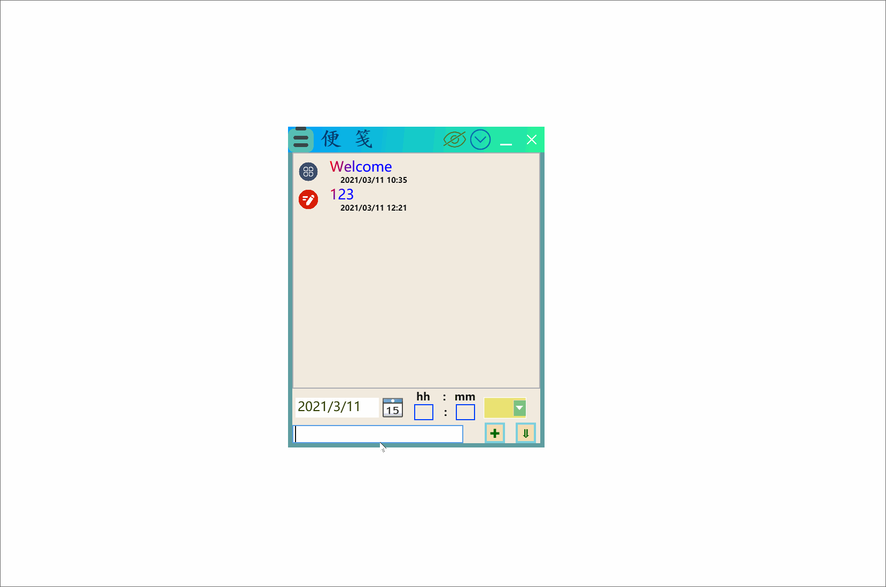
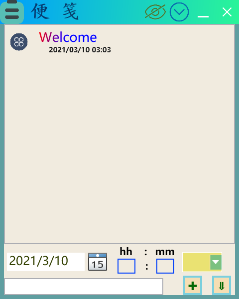
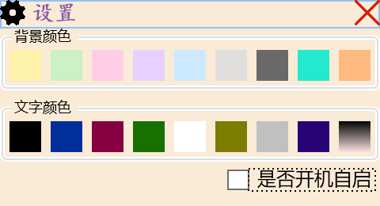
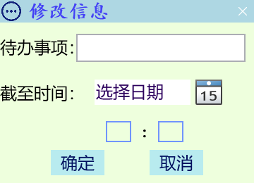
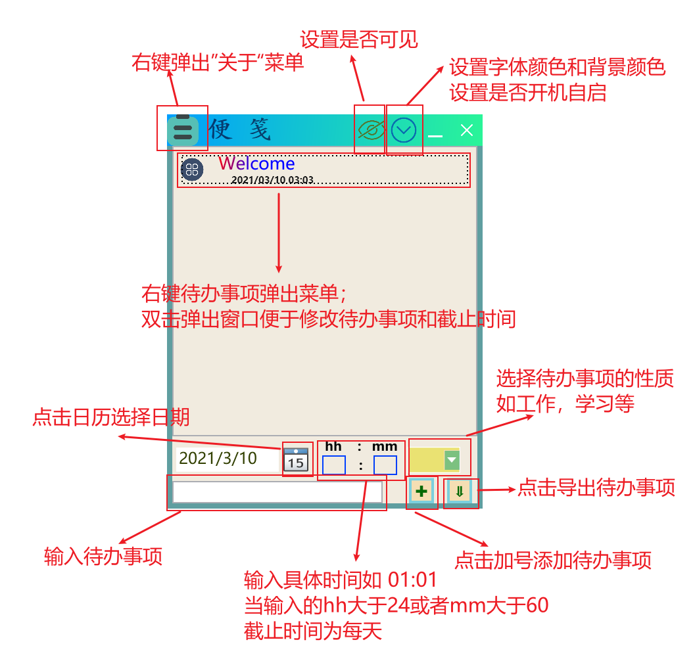

# StickyNote
一个简单的便签程序

### 程序演示
<div align="center"></div>

### 窗口简介

1. MainWindow.xaml (主窗口)

<div align="center"></div>

2. Setting.xaml(设置窗口)

*设置主窗口背景颜色和文件颜色*

<div align="center"></div>

3. MyMessageBox.xaml(修改信息窗口)

<div align="center"></div>
	

### 文件组成

``` 
.
├── App.config
├── App.xaml
├── App.xaml.cs
├── bin
│   └── Release
│       ├── configure.xml
│       ├── StickyNote.exe
│       ├── StickyNote.exe.config
│       └── StickyNote.pdb
├── MainWindow.xaml
├── MainWindow.xaml.cs
├── MyMessageBox.xaml
├── MyMessageBox.xaml.cs
├── Properties
│   ├── AssemblyInfo.cs
│   ├── Resources.Designer.cs
│   ├── Resources.resx
│   ├── Settings.Designer.cs
│   └── Settings.settings
├── resources
│   ├── cancel.ico
│   ├── close.png
│   ├── delete.png
│   ├── Detail.png
│   ├── export.png
│   ├── Infomation.png
│   ├── joy.png
│   ├── life.png
│   ├── main.png
│   ├── minlize.ico
│   ├── more.png
│   ├── nosee.png
│   ├── other.png
│   ├── see.png
│   ├── Setting.png
│   ├── StickyNote.ico
│   ├── StickyNote.png
│   ├── study.png
|   ├── yes.png
│   └── work.png
|    
├── Setting.xaml
├── Setting.xaml.cs
├── StickyNote
│   ├── App.config
│   ├── App.xaml
│   ├── App.xaml.cs
│   ├── bin
│   │   └── Release
│   │       ├── configure.xml
│   │       ├── StickyNote.exe
│   │       ├── StickyNote.exe.config
│   │       └── StickyNote.pdb
│   ├── MainWindow.xaml
│   ├── MainWindow.xaml.cs
│   ├── MyMessageBox.xaml
│   ├── MyMessageBox.xaml.cs
│   ├── Properties
│   │   ├── AssemblyInfo.cs
│   │   ├── Resources.Designer.cs
│   │   ├── Resources.resx
│   │   ├── Settings.Designer.cs
│   │   └── Settings.settings
│   ├── resources
│   │   ├── cancel.ico
│   │   ├── close.png
│   │   ├── Infomation.png
│   │   ├── joy.png
│   │   ├── life.png
│   │   ├── main.png
│   │   ├── minlize.ico
│   │   ├── more.png
│   │   ├── other.png
│   │   ├── Setting.png
│   │   ├── StickyNote.ico
│   │   ├── StickyNote.png
│   │   ├── study.png
│   │   └── work.png
│   ├── Setting.xaml
│   ├── Setting.xaml.cs
│   └── StickyNote.csproj
├── StickyNote.csproj
└── StickyNote.sln

9 directories, 74 files

```
### 使用指南

<div align="center"></div>

### 使用注意

1. 在使用本程序时，会在与.exe文件同路径的文件夹中生成configure.xml文件，该文件的作用为存储用户数据

以下为简单示例 `info`为待办事项内容 `time` 为截止时间 `auto` 为设置开机自启

```xml
<?xml version="1.0" encoding="utf-8"?>
<ListBoxItem>
  <item id="0">
    <info>************</info>
    <time>*****</time>
    <PicIndex>*</PicIndex>
  </item>
  <item id="1">
    <info>****************</info>
    <time>************</time>
    <PicIndex>*</PicIndex>
  </item>
  <item id="2">
    <info>****************</info>
    <time>*******</time>
    <PicIndex>*</PicIndex>
  </item>
  <item id="-1">
    <auto>false</auto>
  </item>
</ListBoxItem>
```

2. 使用鼠标选中一条待办事项后，使用delete键可以删除该事项

3. 右键待办事项会出现菜单（包括删除，导出，详细信息）

``` xmal

<ListBox.ContextMenu>
    <ContextMenu>
        <MenuItem Header="删除(Del)" Click="MenuItem_Click" Foreground="#FF005245" Background="#FFEFFFDD" >
            <MenuItem.Icon>
                <Image Source="resources/delete.png" Width="16" Height="16"></Image>
            </MenuItem.Icon>
        </MenuItem>
        <MenuItem Header="导出" Foreground="#FF005245" Background="#FFEFFFDD">
            <MenuItem.Icon>
                <Image Source="resources/export.png" Width="16" Height="16"></Image>
            </MenuItem.Icon>
            <MenuItem Header="文本文件(*.txt)" Click="MenuItem_Click_1" Background="#FFEAFEFF" Foreground="#FF004B5C"></MenuItem>
            <MenuItem Header="标记文档(*.md)" Click="MenuItem_Click_2"  Background="#FFEAFEFF" Foreground="#FF004B5C"></MenuItem>
            <MenuItem Header="网页文件(*.html)" Click="MenuItem_Click_3" Background="#FFEAFEFF" Foreground="#FF004B5C"></MenuItem>
        </MenuItem>
        <MenuItem Header="详细信息" Foreground="#FF005245" Background="#FFEFFFDD" Click="MenuItem_Click_4">
            <MenuItem.Icon>
                <Image Source="resources/Detail.png"></Image>
            </MenuItem.Icon>
        </MenuItem>
    </ContextMenu>
</ListBox.ContextMenu>

```

4. 点击标题栏上的👁‍🗨可以设置是否可见

*不可见时*
<div align="center"></div>

5. 对时间输入框的更多说明
```cs
            if (hour.Text.Length != 0 && minute.Text.Length != 0)
            {
                HourM = " " + hour.Text + ":" + minute.Text;
            }
            else if (hour.Text.Length != 0 && minute.Text.Length == 0)
            {
                HourM = " " + hour.Text + ":" + DateTime.Now.Minute;
            }
            else if (hour.Text.Length == 0 && minute.Text.Length != 0)
            {
                HourM = " " + DateTime.Now.Hour.ToString() + ":" + minute.Text;
            }
            else
            {
                HourM = " 时间未定";
            }
            string TimeT = YearM + HourM;
            try
            {
                if (int.Parse(hour.Text) > 24 || (int.Parse(hour.Text) > 60))
                {
                    TimeT = " 每天";
                }
            }
            catch{

            }

```
  1. 输入格式为 hh:mm 如 01:01 10:10
  2. 当两个输入框均输入时，按照输入显示
  3. 当其中一个输入框为空时，空的输入框自动补为当前的时钟（分钟）
  4. 当两个输入框为空时，显示“时间未定”；
  5. 当时钟输入超过24或者分钟输入超过60，显示“每天”

6. 右键文件图标可以进行是否开机自启的设置（但目前不能保证可以正常工作）。

7. 在刚开始使用该软件时，请不要尝试新建configure.xml文件，因为这可能会导致某些意想不到的错误。
8. 点击关闭时，会出现询问对话框，点击是会使窗口直接关闭，点击否会使窗口缩小至托盘中。

### 存在问题

1. 主窗口在向左拉伸时，会出现窗口抖动的问题

2. 该程序的调试的时间较短，所以可能存在一些bug还未发现

3. 开机自启功能可能存在问题

### 项目说明

| | |
:-:|:-:
IDE| Visual Studio 2017
语言|C#
用户界面框架|WPF
.Net版本|4.6.1
